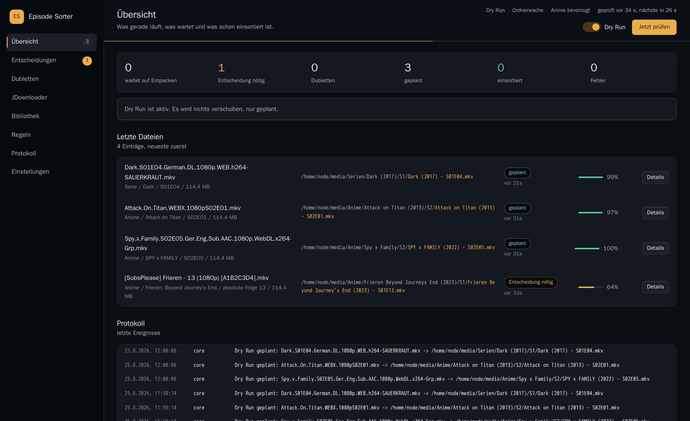

# Episode Sorter

Sorts finished JDownloader downloads into the right anime, series and movie folders.
It reads the release name, checks the title against TMDb and AniList, finds the folder
your library already uses, and moves the file there. Anything it is not sure about
waits for you in the dashboard instead of being guessed.



## What it does

- **Waits until a download is really finished.** A file is only touched once it stopped
  growing and no archive is still being extracted next to it.
- **Reads the name.** `S02E01`, `S2E1`, `2x01`, `S02E01-E03`, `Episode 37`, `EP037`,
  `Special`, `OVA`, absolute anime numbering like `[SubsPlease] Frieren - 12`. Release
  junk such as `1080p`, `WEB-DL`, `x265`, `GERMAN`, group names is stripped from the title.
- **Checks the title.** TMDb for everything, AniList and MyAnimeList for anime, including
  a plausibility check for season and episode.
- **Uses the folder you already have.** All configured library paths are indexed. If the
  title exists somewhere, the episode goes exactly there, whatever the default path says.
  Existing folders keep their name and their season layout.
- **Moves safely.** Free space, permissions and an existing target are checked first.
  Across filesystems the file is copied, verified, and only then the source is removed.
  Subtitles come along and are renamed with it.
- **Never overwrites.** A duplicate lands in a comparison view with size, resolution,
  codec and languages of both files, and you decide.

## Quick start

```bash
git clone https://github.com/Nicolai14/episode-sorter-jdownloader.git
cd episode-sorter-jdownloader
cp .env.example .env      # TMDB_API_KEY, and the JDownloader account if you have one
docker compose up -d --build
```

The dashboard runs on port 18080. It starts in **dry run**: everything is analysed and
planned, nothing is moved.

## How you use it

1. Let a few real downloads run and look at the planned targets under *Übersicht*.
2. When they look right, switch off *Dry Run* in the header. From then on files are moved
   within a minute of being ready.
3. Files the sorter is unsure about wait under *Entscheidungen*: several matching titles,
   unclear media type, absolute anime numbering, specials, season packs, missing metadata.
   Pick the right title, correct season or episode, and confirm.
4. Tick *Als Regel speichern* while confirming and the next file with the same title
   pattern is handled automatically.

## What the result looks like

```
Attack on Titan (2013)/
└── S2/
    ├── Attack on Titan (2013) - S02E01.mkv
    └── Attack on Titan (2013) - S02E01.de.srt

Inception (2010)/
└── Inception (2010).mkv
```

Season folders follow whatever the series folder already uses, `S2` here. Only brand new
folders are created from the template.

## Settings that matter

Everything is editable in the dashboard under *Einstellungen*, the environment variables
only seed the first start.

| Setting | Meaning |
| --- | --- |
| `download_dir` | folder that is watched |
| `anime_path_1`, `anime_path_2` | anime libraries, both are indexed |
| `series_path`, `series_path_2`, `movies_path` | the other libraries |
| `default_anime_path` and friends | where a brand new title goes |
| `dry_run` | plan only, do not move |
| `auto_threshold` | confidence needed to sort without asking, default 85 |
| `prefer_anime` | treat genuinely ambiguous episodic files as anime |
| `verify_mode` | `size` or `sha256` when copying across filesystems |

## Safety

- Dry run is the delivery state.
- A target file is never overwritten automatically.
- The source is removed only after the copy has been verified.
- Failed jobs are retried a few times and stay visible with their error.

## More

- [Running it on TrueNAS, and Click'n'Load from the browser](docs/truenas.md)
- Extra tool: `python -m app.tools.prune_tracks` removes audio and subtitle tracks you do
  not want, as a pure remux without re-encoding. Dry run unless `--apply` is given.

## Development

```bash
pip install -r backend/requirements.txt pytest httpx
python -m pytest
ES_DATA_DIR=./data ES_WEB_DIR=./web uvicorn app.main:app --app-dir backend --reload --port 8080
```

The dashboard is plain HTML, CSS and ES modules, there is no build step. The interface
language is German.
